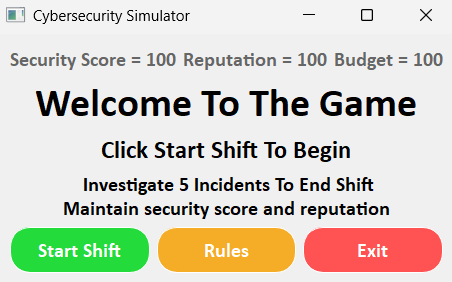
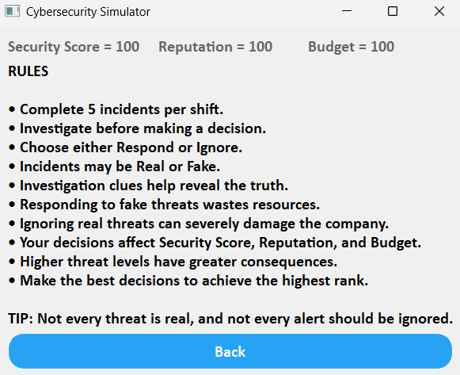
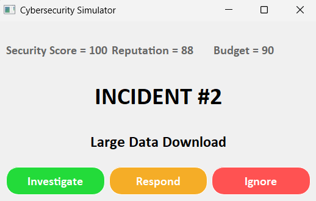
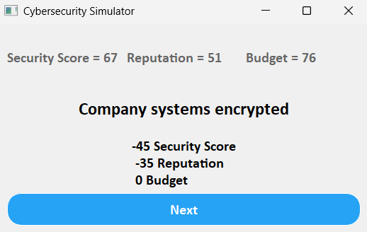
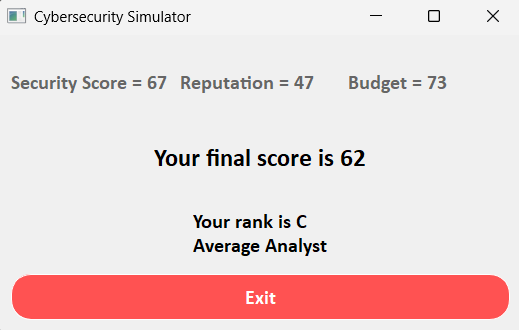

# 🛡️ CyberSecurity Sentinel

An interactive Python and PyQt5 desktop application where users respond to simulated cybersecurity incidents by analyzing threats and making critical incident response decisions.



---

## 📖 About the Project

This is the first major Python project I built after completing a comprehensive Python course. The goal of this project was to apply the concepts I had learned by building a complete desktop application from scratch rather than following a tutorial. Throughout its development, I strengthened my problem-solving skills, Python fundamentals, object-oriented programming (OOP), GUI development with PyQt5, and overall software design. This project marks the beginning of my software development portfolio and reflects my approach to learning by building real-world applications from scratch.

---

## ✨ Features

- Interactive desktop GUI built with PyQt5
- Randomized cybersecurity incident scenarios and threat status
- Threat investigation system
- Investigation-based decision making
- Dynamic scoring system based on threat severity
- Security Score, Reputation, and Budget tracking
- Performance ranking system (S+ to F)
- Multiple application screens
- Object-oriented architecture (OOP)

---

## 🛠️ Technologies Used

- Python
- PyQt5
- Object-Oriented Programming (OOP)
- Git
- GitHub

---

## 📸 Screenshots

### Rules



### Incident



### Decision Result



### Final Results



---

## 🚀 Installation

1. Clone the repository

```bash
git clone https://github.com/Pravesh-10/cybersecurity-sentinel.git
```

2. Navigate to the project folder

```bash
cd cybersecurity-sentinel
```

3. Install dependencies

```bash
pip install -r requirements.txt
```

4. Run the application

```bash
python main.py
```

---

## 🎮 How to Play

1. Start a new shift.
2. Investigate each cybersecurity incident.
3. Analyze the investigation clues.
4. Decide whether to Respond or Ignore.
5. Manage your Security Score, Reputation, and Budget.
6. Complete all incidents to receive your final rank.

---

## ⭐ Project Status

✅ Completed – This project represents my first major Python desktop application and serves as a milestone in my software development journey.

---

## 👨‍💻 Author

**Pravesh SV**
